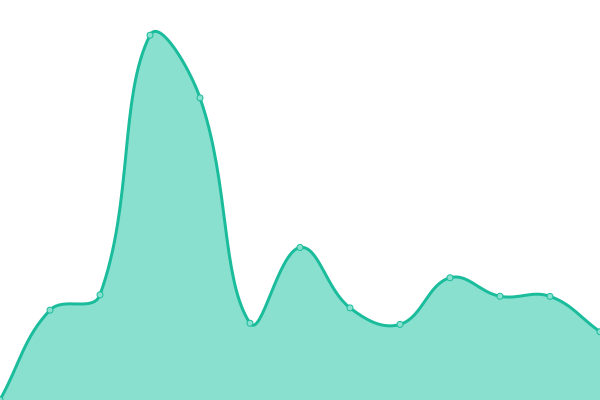

# [📈 Live Status](https://streamsystem.github.io/upstream): <!--live status--> **🟩 All systems operational**

This repository contains the open-source uptime monitor and status page for [Stream](https://streamsystem.com), powered by [Upptime](https://github.com/upptime/upptime).

With [Upptime](https://upptime.js.org), you can get your own unlimited and free uptime monitor and status page, powered entirely by a GitHub repository. We use [Issues](https://github.com/streamsystem/upstream/issues) as incident reports, [Actions](https://github.com/streamsystem/upstream/actions) as uptime monitors, and [Pages](https://streamsystem.github.io/upstream) for the status page.

<!--start: status pages-->
<!-- This summary is generated by Upptime (https://github.com/upptime/upptime) -->
<!-- Do not edit this manually, your changes will be overwritten -->
<!-- prettier-ignore -->
| URL | Status | History | Response Time | Uptime |
| --- | ------ | ------- | ------------- | ------ |
|  [ssadmin](https://ssadmin.streamsystem.com) | 🟩 Up | [ssadmin.yml](https://github.com/streamsystem/upstream/commits/HEAD/history/ssadmin.yml) | 

 930ms
     
 | 

<a href="https://streamsystem.github.io/upstream/history/ssadmin">99.45%</a>
    

|  [Stream](https://stream.dz) | 🟩 Up | [stream.yml](https://github.com/streamsystem/upstream/commits/HEAD/history/stream.yml) | 

 1375ms
     
 | 

<a href="https://streamsystem.github.io/upstream/history/stream">99.47%</a>
    

|  [Bomare Company](https://bomarecompany.com) | 🟩 Up | [bomare-company.yml](https://github.com/streamsystem/upstream/commits/HEAD/history/bomare-company.yml) | 

 1365ms
     
 | 

<a href="https://streamsystem.github.io/upstream/history/bomare-company">99.48%</a>
    

<!--end: status pages-->

[**Visit our status website →**](https://streamsystem.github.io/upstream)

## 📄 License

- Powered by: [Upptime](https://github.com/upptime/upptime)
- Code: [MIT](./LICENSE) © [Anand Chowdhary](https://anandchowdhary.com), supported by [Pabio](https://pabio.com)
- Data in the `./history` directory: [Open Database License](https://opendatacommons.org/licenses/odbl/1-0/)
